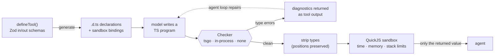

# toolweave

[](https://dl.circleci.com/status-badge/redirect/gh/Pascal-Lohscheidt/toolweave/tree/main)
[](https://www.npmjs.com/package/toolweave)
[](https://www.npmjs.com/package/toolweave)
[](./LICENSE)

**Typed code-mode tool orchestration for LLM agents.**

Give your agent one tool instead of twenty: it writes a **typed TypeScript program** that
composes your tools — loops, `Promise.all`, conditionals, data reshaping — and only the final
`return` value comes back. The program is type-checked against declarations generated from your
Zod schemas _before it runs_, so the model fixes its mistakes through your agent framework's
normal tool loop, and intermediate data never touches the context window.

```text
 classic tool calling                        toolweave
 ────────────────────                        ─────────
 model → searchProducts        1 round-trip  model → one TS program      1 round-trip
 model → getInventory (×12)   12 round-trips        │ type-check → run
 model → getShippingQuote      1 round-trip         ▼
 model → convertCurrency       1 round-trip  final answer
 model reads it all back…                    (intermediate data stays in the sandbox)
```

toolweave itself **never calls an LLM**. It is a runtime, not a framework: you hand the model a
declarations file and a single `execute_typescript` tool, and any agent loop — LangGraph,
Claude API tool use, your own `while` loop — drives repair and execution.

## See it repair itself

A mistake gpt-4o-mini actually makes in [`examples/langgraph-agent`](./examples/langgraph-agent):
guessing a field that isn't in the search results.

```ts
const customer = await getCustomer({ email: 'anna@example.com' });
const products = await searchProducts({ maxPrice: 100 });
const quote = await getShippingQuote({
  weightKg: products[0].weightKg,
  country: customer.address.country,
});
return { cheapest: products[0], quote };
```

The check fails before anything executes, and the diagnostic goes back as the tool result
(verbatim `execute_typescript` output):

```text
Type errors:
1. line 4, col 25: TS2339 Property 'weightKg' does not exist on type '{ id: string; name: string; category: string; price: number; }'.

Fix these errors and call execute_typescript again with the corrected program. 1 repair attempt remaining.
```

The model reads the diagnostic, fetches the weight through `getProduct` instead, and the
corrected program runs to completion — one visible round-trip later, with zero hallucinated
data reaching your user.

## How it works



1. **Declarations, not JSON schemas.** Each Zod tool becomes an ambient
   `declare function` with JSDoc — the format models have seen the most of.
2. **Check first.** The program is wrapped and type-checked under `strict`, ES2023 lib,
   **no DOM, no Node** — the model can only reach what you declared.
3. **Diagnostics as tool output.** Type errors return as a numbered, line-mapped list with a
   repair budget. No extra LLM plumbing: your framework's existing tool loop is the repair loop.
4. **Sandboxed execution.** Types are stripped (positions preserved — runtime stack lines map
   straight back to the model's source) and the program runs in a fresh QuickJS wasm context
   with hard limits. Tool calls cross the boundary as host-settled promises, and every input
   and output is re-validated with Zod on the host — a program that lies to the type checker
   still can't call a tool with bad data.

## Quick start

```bash
npm install toolweave zod
# recommended: the native TS 7 checker (default, ~0.4ms warm checks)
npm install @typescript/native-preview
# or the classic in-process fallback
npm install typescript
```

```ts
import { z } from 'zod';
import { createRuntime, defineTool } from 'toolweave';

const searchDocs = defineTool({
  name: 'searchDocs',
  description: 'Full-text search over the knowledge base',
  input: z.object({ query: z.string(), limit: z.number().default(5) }),
  output: z.array(z.object({ id: z.string(), text: z.string() })),
  impl: async ({ query, limit }) => db.search(query, limit),
});

const runtime = createRuntime({
  tools: [searchDocs],
  checker: 'tsgo', // 'tsgo' | 'in-process' | 'none' | custom Checker
  sandbox: 'quickjs', // 'quickjs' | custom Sandbox
  maxRepairs: 2,
  limits: { timeoutMs: 10_000, memoryMb: 64 },
});

// One tool for any agent framework — description includes the declarations:
import { asTool } from 'toolweave';
const codeTool = asTool(runtime);
// { name: 'execute_typescript', description, inputSchema, inputJsonSchema, execute }

// …or drive it yourself:
const result = await runtime.execute(modelWrittenCode);
```

The model sees real TypeScript (JSDoc from `.describe()`, optionals from `.default()`):

```ts
/** Full-text search over the knowledge base */
declare function searchDocs(input: {
  query: string;
  /** @default 5 */
  limit?: number;
}): Promise<{ id: string; text: string }[]>;
```

and writes a plain statement body: `await` is available, `import`/`export` are syntax errors,
and the result is produced with a top-level `return`.

### LangGraph

```ts
import { asLangGraphTool } from 'toolweave/adapters/langgraph';
import { createReactAgent } from '@langchain/langgraph/prebuilt';

const agent = createReactAgent({ llm, tools: [asLangGraphTool(runtime)] });
```

Any framework with a native tool loop works the same way. The [`examples/`](./examples) folder
has a framework-free walkthrough and a complete LangGraph chat app whose UI shows every program
the model writes.

## Every outcome is a value

`execute()` never throws for program-level problems — everything the model (or your agent code)
needs to react to is in the result:

```ts
type ExecutionResult =
  | { ok: true; value: unknown; logs: string[] }
  | { ok: false; phase: 'check'; diagnostics: Diagnostic[]; repairsRemaining: number }
  | {
      ok: false;
      phase: 'runtime';
      error: { name: string; message: string; line?: number };
      logs: string[];
    }
  | { ok: false; phase: 'limit'; kind: 'timeout' | 'memory' | 'stack'; logs: string[] };
```

`asTool(runtime)` renders these as model-friendly text: numbered diagnostics with a countdown of
repair attempts, runtime errors with the mapped source line, and a hard stop
("Do not retry; report the problem to the user") once the budget is spent.
`runtime.resetRepairs()` starts a fresh budget — call it once per user request.

## The routeable checker

The type-check is the only expensive step, and its cost is dominated by backend warm-up — so it
lives behind one interface with swappable backends. Measured on an M-series laptop
(`pnpm bench`):

| Backend          | Cold (first check) | Warm check | Needs                             |
| ---------------- | ------------------ | ---------- | --------------------------------- |
| `tsgo` (default) | ~60ms              | **~0.4ms** | `@typescript/native-preview`      |
| `in-process`     | ~280ms             | ~1.2ms     | `typescript` (>=5.5 <7)           |
| `none`           | —                  | —          | nothing (skips checking entirely) |

- `tsgo` speaks LSP to one long-lived `tsgo --lsp` subprocess (TypeScript 7 dropped the classic
  programmatic API). If the binary is missing, toolweave **falls back to `in-process`
  automatically** with a one-time warning — agent code never changes.
- Every backend passes the **same conformance suite** — same fixtures, same expected
  diagnostics, same line mapping. That shared contract is what makes them drop-in swappable,
  and it's the bar any custom backend can test itself against.
- Checked programs get `strict`, ES2023 lib, no DOM, no Node types, and `erasableSyntaxOnly`
  (anything the strip-only transpiler couldn't handle surfaces as a repairable type error,
  never a transpile crash).
- Custom backend: any `{ check(source, decls): Promise<Diagnostic[]> }`.

## The sandbox

The default sandbox is QuickJS compiled to wasm (sync single-file build — no native binaries,
no `.wasm` resolution issues in bundlers or test runners):

- **Fresh runtime + context per run.** Model programs are untrusted; nothing persists between
  executions.
- **Hard limits**: wall-clock deadline (guest interrupt handler + host-side race), memory cap,
  guest stack cap. Exceeding one yields `{ phase: 'limit' }`, never a hung process.
- **Validated boundary**: tool inputs and outputs are Zod-checked on the host side of every
  call.
- **Source-true errors**: type stripping via [amaro](https://github.com/nodejs/amaro) replaces
  types with whitespace, so guest stack lines map back to the model's program with a constant
  offset — no source maps.
- The `Sandbox` interface is pluggable for isolated-vm / Worker / E2B-style backends.

## API at a glance

| Export                                                                                                        | What it does                                                                                  |
| ------------------------------------------------------------------------------------------------------------- | --------------------------------------------------------------------------------------------- |
| `defineTool({ name, description, input, output, impl })`                                                      | Typed tool from Zod schemas; `impl` receives parsed input, its result is validated on return. |
| `createRuntime({ tools, checker?, sandbox?, maxRepairs?, limits? })`                                          | The runtime; all options have working defaults.                                               |
| `runtime.declarations()`                                                                                      | The generated `.d.ts` string, if you want it in your system prompt.                           |
| `runtime.execute(code)`                                                                                       | Check → strip → run. Returns an `ExecutionResult`.                                            |
| `asTool(runtime)`                                                                                             | Framework-agnostic `execute_typescript` tool descriptor — the port custom adapters build on.  |
| `runtime.resetRepairs()` / `runtime.dispose()`                                                                | Fresh repair budget / tear down checker subprocess and sandbox.                               |
| `asLangGraphTool(runtime)`                                                                                    | LangChain `StructuredTool` (subpath `toolweave/adapters/langgraph`).                          |
| `TsgoChecker`, `InProcessChecker`, `NoneChecker`, `FallbackChecker`, `QuickJSSandbox`, `generateDeclarations` | The building blocks, exported for custom wiring.                                              |

## Design principles

- **Bring your own loop.** toolweave never talks to a model. Repair happens through whatever
  tool loop you already run, which means it works identically across frameworks and stays out
  of your prompt strategy.
- **The type system is the guardrail.** Hallucinated tools, wrong argument shapes, misused
  results, missing `await`s — all caught before execution, each with a line number the model
  can act on.
- **Fail as data.** Timeouts, memory caps, guest exceptions, and validation failures are
  ordinary result values with enough structure to route on.
- **No native dependencies.** Checker (subprocess or pure JS), transpiler (wasm), and sandbox
  (wasm) all install anywhere Node ≥ 20 runs.

## Examples

- [`examples/basic-weather`](./examples/basic-weather) — no framework: print the declarations,
  execute a hand-written program, watch a broken one repair.
- [`examples/langgraph-agent`](./examples/langgraph-agent) — a ReAct agent over a ten-tool
  in-memory shop backend, with a chat UI that shows each generated program, the sandbox result,
  and the repair loop live.

## Development

```bash
pnpm install
pnpm test            # vitest: unit + conformance + e2e + leak checks, with typecheck
pnpm bench           # checker latency, cold vs warm
pnpm lint && pnpm fmt
pnpm build           # vp pack → dist/ (esm + cjs + dts)
```

Requires Node ≥ 20. The repo uses [Vite+](https://viteplus.dev/) (`vp`) for
build/test/lint/fmt. Contributions welcome — please use
[conventional commits](https://www.conventionalcommits.org/); they drive versioning and the
changelog.

### Releases

Merges to `main` publish automatically via CircleCI:

1. `scripts/check-publish-needed.ts` halts the publish job if nothing under `src/`,
   `package.json`, or `vite.config.ts` changed since the last release tag.
2. `scripts/bump-and-tag.ts` computes the semver bump from conventional commits
   (`feat` → minor, `fix`/`perf` → patch, breaking → major; pre-1.0 breaking → minor), writes
   `package.json` (uncommitted — git tags `toolweave@<version>` are the source of truth), tags,
   and pushes the tag.
3. The package is built and published with `npm publish` via
   npm **trusted publishing** (CircleCI OIDC — no long-lived `NPM_TOKEN`).

One-time setup: configure a CircleCI trusted publisher on the npm package, and
add a GitHub **deploy key with write access** so the pipeline can push release tags.
`pnpm changelog` regenerates `CHANGELOG.md`.

## License

MIT © Pascal Lohscheidt
